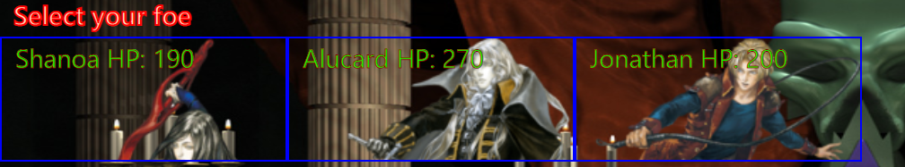

# RPG_Game - Castlevania: Halls of Supremacy

Play Castlevania: Halls of Supremacy with the following rules:

If your health is lowered to 0 you will lose. The following will be displayed:

* "You Lose! Click the title to play again!" When this happens click the title that looks like this -

# How to win

Successfully defeat all enemies with your selected character.

There is a final message that pops up if you win. It will be:
* "You Win! Click the title to play again!" When this happens click the title that looks like this -

# How to play

Step 1) The game starts with an four characters under the heading "Who do you wish to play as".
* Select your character you want to play with. 
* NOTE: They all have different health points ( HP ) but all of them are able to win.

(Step 2) After you select your character your enemies will be moved under the heading "Select your foe".
* Select which enemy you wish to fight against.
* NOTE: The order in which you select your enemies will help you win!

(Step 3) When your enemy is moved to the "Battle Arena" you may "Choose your attack"

* Attack
* (Special Ability) This Special Ability will be unique for each character.
    * Each 'Special Ability' is described to the right of the button.

(Step 4) If you defeat the enemy you will be offered to select another enemy (Step 2)
* If you defeated all the enemies, you win!

* If your enemy defeated you, you lose!

    * Click the title "Castlevania: Halls of Supremacy" to play again.

